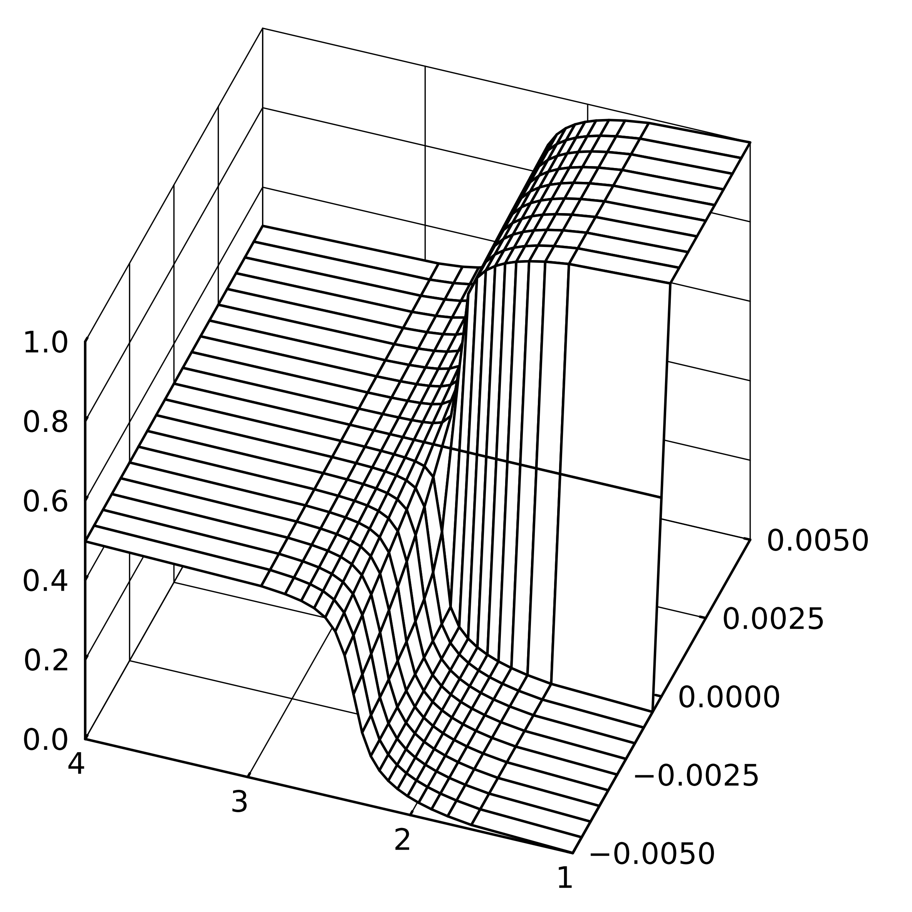

# atelier-tensor-network

  
  

 

2025年度『ぶつりのあとりえ。』の記事「テンソルネットワークって？ 沖縄のフォン・ノイマン」の図の作成に用いたプログラム．

プログラムはすべてJuliaで書かれている．

## ファイルの説明と使い方
<pre>
├───ctmrg
│       CTMRG_main.jl         # CTMRG[1][2]のアルゴリズム
│       ising_ctmrg_spm.jl    # 自発磁化のグラフの作成
│       ising_ctmrg_sscor.jl  # 最近接スピン相関のグラフの作成
│       ising_dual_ctmrg.jl   # 裏格子変換を行った場合の最近接スピン相関のグラフの作成
│
└───snapshot
&nbsp;       snapshot.jl            # スナップショット[3]のアルゴリズム
&nbsp;       snapshot_oil_water.jl  # 水と油の図[4]の作成
&nbsp;       snapshot_something.jl  # テキトーに考えた図の作成
</pre>

`ctmrg/CTMRG_main.jl`, `/snapshot/snapshot.jl`にはアルゴリズムが書かれており，実行しても何も起きない．

図の作成にはそれ以外の.jlファイル（`snapshot/snapshot_something.jl`など）を実行する．

## 参考文献

[1] T. Nishino and K. Okunishi, “Corner Transfer Matrix Renormalization Group

Method,” J. Phys. Soc. Jpn. 65, 891 (1996), arXiv:cond-mat/9507087.

[2] T. Nishino and K. Okunishi, “Corner Transfer Matrix Algorithm for Classical Renor-

malization Group,” J. Phys. Soc. Jpn. 66, 3040 (1997), arXiv:cond-mat/9705072.

[3] K. Ueda et al., “Snapshot Observation for 2D Classical Lattice Models by Cor-

ner Transfer Matrix Renormalization Group,” J. Phys. Soc. Jpn. 74, 111 (2005),

arXiv:cond-mat/0409445.

[4] K. Ueda et al., “Critical Point of a Symmetric Vertex Model,” J. Phys. Soc. Jpn.
74, 1871 (2005), arXiv:cond-mat/0501277.

